<h1 align="center">Hi, I'm Shankar 👋</h1>

  

  <b>Frontend Developer &nbsp;·&nbsp; React &nbsp;·&nbsp; Next.js &nbsp;·&nbsp; TypeScript &nbsp;·&nbsp; AI</b>

  I build scalable, high-performance and interactive digital experiences 
  using modern frontend technologies, clean architecture and AI-powered solutions.

  <a href="https://my-portfolio-orcin-iota-85.vercel.app/">Portfolio</a> &nbsp;·&nbsp;
  <a href="https://www.linkedin.com/in/shankar-shankar-7329671a0">LinkedIn</a> &nbsp;·&nbsp;
  <a href="mailto:shankar300597@gmail.com">Email</a>

 

## What I Do

  

## Tech Stack

  

## Featured Projects

  

  <a href="https://magicalphotos.net">Magical Moments Photography ↗</a> &nbsp;·&nbsp;
  <a href="https://grillmasters.in">Grillmasters ↗</a> &nbsp;·&nbsp;
  <a href="https://my-portfolio-orcin-iota-85.vercel.app/">More on my portfolio ↗</a>

## GitHub Activity

  
  

  

## Let's Connect

  
  
  
  

Open to frontend roles and interesting product work.

